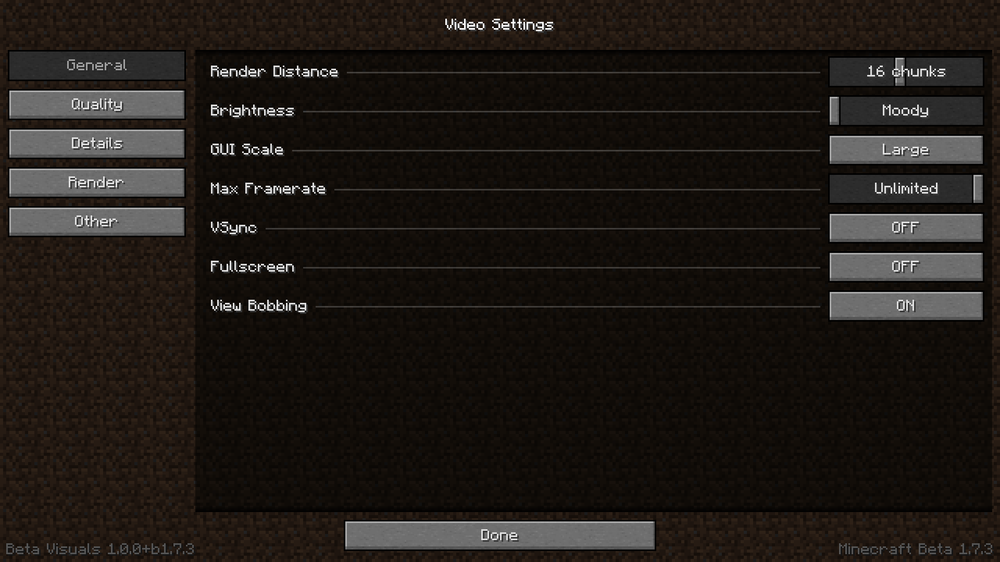
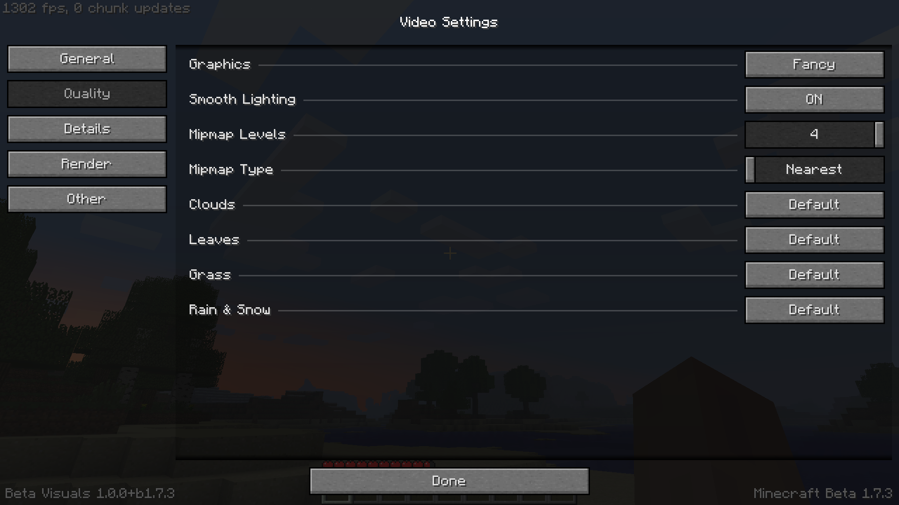

# Beta Visuals for b1.7.3
A complete revamp of the Video Settings screen with tons of customization. Inspired by OptiFine and BTA.

|           GUI in main menu            |              GUI in-game              | 
|:-------------------------------------:|:-------------------------------------:|
|  |  |

## Features
- Categories:
  - Settings are neatly organized with the ability to scroll
  - Plans to support adding custom categories
- General settings:
  - Render distance slider
  - Brightness slider
  - FPS limit slider
  - VSync toggle
  - Fullscreen toggle
- Quality settings:
  - Mipmap levels and type (supports [MCPatcherFabric](https://github.com/kimoVoid/mcpatcherfabric))
  - Cloud quality (can be toggled off)
  - Leaf quality
  - Grass quality
  - Rain & snow quality (can be toggled off)
- Detail settings:
  - Cloud height slider
  - Better grass toggle
  - Vignette toggle
  - Entity shadows toggle
- Render settings:
  - Fog start slider
- Other settings:
  - Show FPS counter
  - Async screenshots
  - Chat customization:
    - Text opacity
    - Background opacity
    - Chat scale

## Usage
1. Grab the Ornithe gen2 instance: https://ornithemc.net/ornithe-installer-rs/?prism&minecraft-version=b1.7.3&gen=2
2. Import the instance on Prism.
3. Get the latest release: https://github.com/kimoVoid/beta-visuals/releases/latest
4. Simply place it in your mods folder and play.

## Mod recommendations
- [Reframed](https://github.com/kimoVoid/reframed) for modern LWJGL 3 and overall better experience.
- [MCPatcherFabric](https://github.com/kimoVoid/mcpatcherfabric) for HD textures.